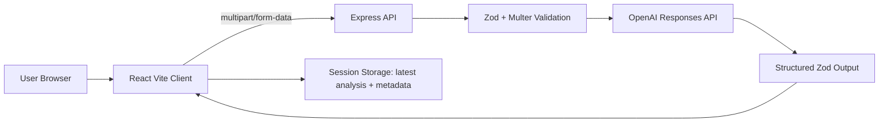

# FraudFirst

**AI Cyber-Fraud Emergency Assistant**  
Act fast. Save evidence. Report right.

FraudFirst is a hackathon-ready web application that helps people assess suspicious messages or payment incidents, preserve useful evidence, and prepare an AI-assisted incident summary for official reporting.

## Problem Statement

Cyber-fraud victims often lose precious time because they are unsure what evidence to save, who to contact, and how to describe what happened. FraudFirst offers a calm guided workflow for the first response window.

## Solution Overview

Users choose their situation, upload screenshots or paste suspicious text, add optional transaction details, review the submission, and send it to a real multimodal OpenAI model through the Express backend. The app returns a structured dashboard with risk indicators, immediate actions, missing evidence, timeline, and a printable report.

FraudFirst never claims to file official complaints and never guarantees fund recovery.

## Community Impact

FraudFirst is designed for stressful moments: it avoids fear-based language, encourages evidence preservation, and points users toward verified official resources such as India’s 1930 helpline and the National Cybercrime Reporting Portal.

## Key Features

- React/Vite dark premium interface with responsive SCSS
- Four-step incident workflow
- Multiple memory-only screenshot uploads
- Pasted suspicious message analysis
- Optional transaction detail capture
- Real OpenAI Responses API integration with structured output
- Prompt-injection resistant analysis prompt
- Server-side Zod validation of inputs and AI output
- Results dashboard with masked sensitive values
- Printable incident report with print stylesheet
- Session-only storage for latest analysis and non-image metadata
- Helmet, CORS, rate limiting, request limits, timeout handling

## User Workflow

1. Landing page
2. Choose situation
3. Upload or paste evidence
4. Add incident details
5. Review submission
6. Real AI analysis
7. Results dashboard
8. Printable incident report

## Technology Stack

Frontend: React, Vite, JavaScript, JSX, React Router, SCSS, Lucide React, Fetch API.  
Backend: Node.js, Express.js, OpenAI official JavaScript SDK, Multer memory storage, Zod, Helmet, CORS, express-rate-limit, dotenv.  
Testing: Vitest and Supertest.

## Architecture



## Folder Structure

```text
fraudfirst/
  client/
    src/components
    src/config
    src/pages
    src/services
    src/styles
    src/utils
  server/
    src/config
    src/controllers
    src/middleware
    src/prompts
    src/routes
    src/schemas
    src/services
    tests/
```

## Local Setup

```bash
npm install
cp client/.env.example client/.env
cp server/.env.example server/.env
```

Configure `server/.env`:

```env
PORT=5000
NODE_ENV=development
CLIENT_ORIGIN=http://localhost:5173
OPENAI_API_KEY=your_server_side_key
OPENAI_MODEL=a_multimodal_model_with_structured_output
```

The OpenAI API key belongs only on the server. Do not create a `VITE_` key variable and do not commit real `.env` files.

## AI Key

Create an API key from the OpenAI platform dashboard and place it in `server/.env` as `OPENAI_API_KEY`. Set `OPENAI_MODEL` to a multimodal model that supports image understanding and structured outputs. The app reads the model from the environment and does not hardcode a production model throughout source code.

Real AI is required. No production mock mode exists. If `OPENAI_API_KEY` or `OPENAI_MODEL` is missing, the server still starts, `/api/health` works, and `/api/analyze` returns HTTP 503 with a safe configuration error.

## Commands

```bash
npm run dev      # run client and server together
npm run client   # run Vite client
npm run server   # run Express server
npm run build    # production client build
npm run lint     # lint client and server
npm run test     # backend tests
```

## API Endpoints

- `GET /api/health` returns `{ status: "ok", aiConfigured: boolean }`.
- `POST /api/analyze` accepts multipart form fields and up to four PNG/JPEG/WebP screenshots.

## Security Approach

FraudFirst uses Helmet, CORS allowlisting, rate limiting, request-size limits, memory-only Multer uploads, MIME and file-signature checks, central error handling, safe production errors, and server-only OpenAI credentials.

## Privacy Approach

Uploaded files are processed in memory and are not intentionally stored by the application. The frontend stores only the latest validated AI response and non-image form metadata in `sessionStorage`. It does not store blobs, previews, API keys, passwords, OTPs, PINs, CVVs, or full uploaded evidence.

## AI Safety Approach

The backend prompt treats screenshots and pasted messages as untrusted evidence, ignores instructions inside evidence, forbids requesting secrets, forbids recommending additional transfers or remote-access software, and requires cautious language. AI output is validated before the UI receives it. Malformed AI output returns an error instead of fake fallback data.

## Limitations and Risks

- AI results must be reviewed by the user.
- FraudFirst does not submit complaints automatically.
- Screenshot quality may limit extraction accuracy.
- Official resources may vary by jurisdiction; this MVP centralizes India’s 1930 helpline and cybercrime portal.
- The printable MVP includes file metadata but not uploaded screenshots.

## Future Roadmap

- Country-specific official resource packs
- Optional local encrypted report export
- Better OCR confidence display
- Additional language coverage
- Guided bank-support evidence checklist
- Deployment hardening and observability without sensitive logging

## Deployment

Build the client with `npm run build`. Deploy `server/` with server-side environment variables set for `OPENAI_API_KEY`, `OPENAI_MODEL`, `CLIENT_ORIGIN`, and `PORT`. Serve the Vite build through a static host or reverse proxy and point `VITE_API_BASE_URL` at the deployed API.

## Demo Placeholders

- Live demo: TBD
- Screenshots: TBD
- Demo video: TBD
- Hackathon team: TBD
